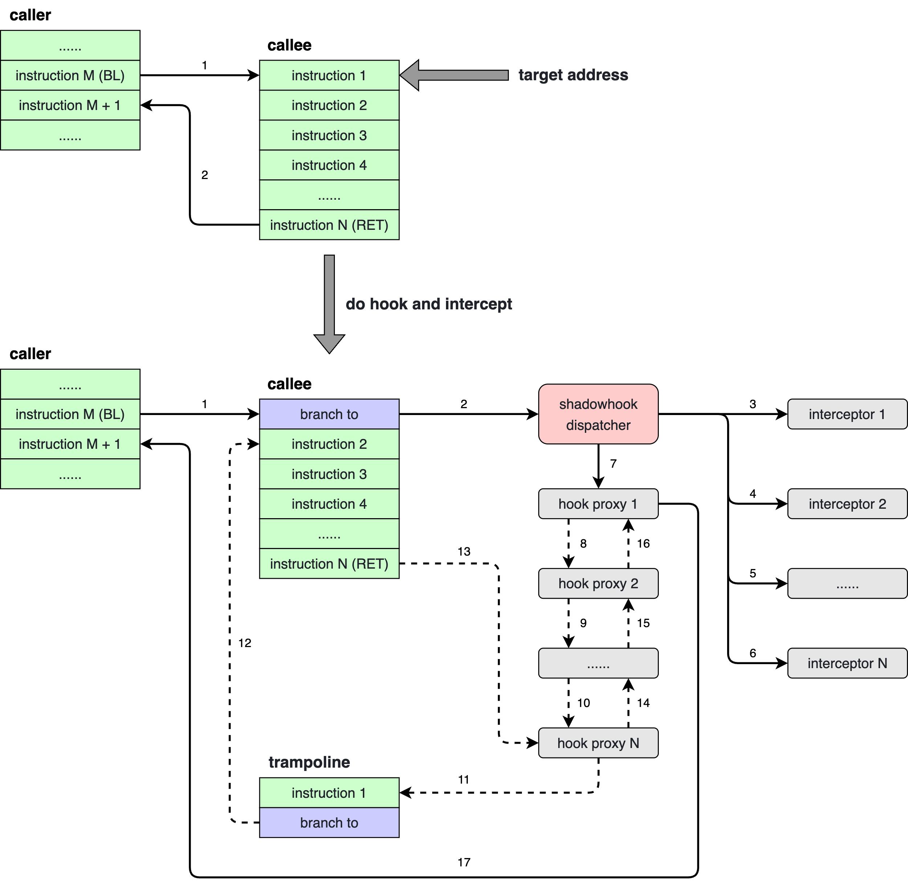
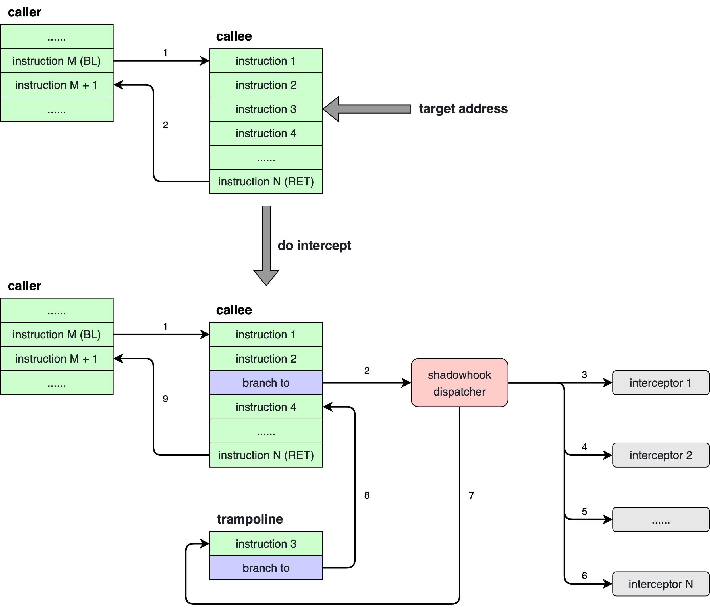
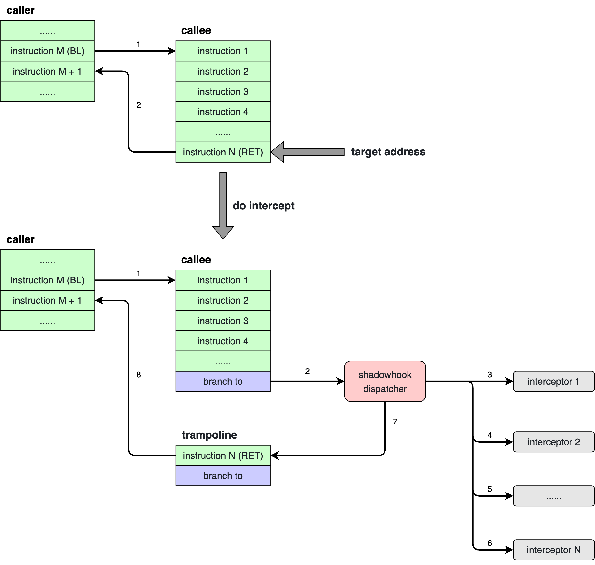
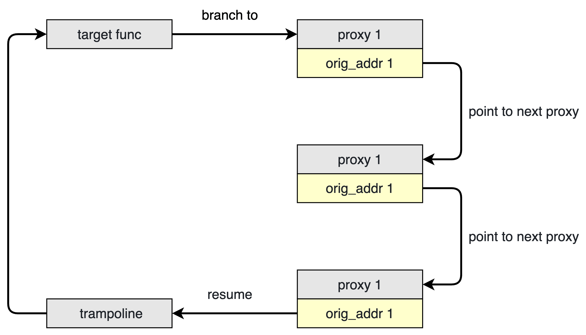
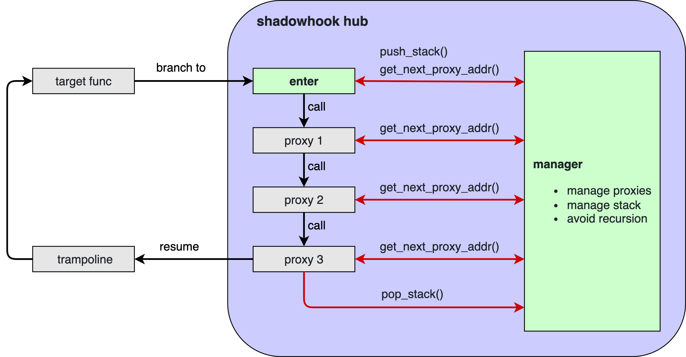

# **shadowhook Manual**

[shadowhook 手册 - 简体中文](manual.zh-CN.md)


# Introduction

**shadowhook is an Android inline hook library.** Its goals are:

- **Stability** - Can be stably used in production apps.
- **Compatibility** - Always maintains backward compatibility of API and ABI in new versions.
- **Performance** - Continuously reduces API call overhead and additional runtime overhead introduced by hooks.
- **Functionality** - Besides basic hook functionality, provides general solutions for "hook-related" issues.

> If you need an Android PLT hook library, try [ByteHook](https://github.com/bytedance/bhook).


# Features

- Supports armeabi-v7a and arm64-v8a.
- Supports Android `4.1` - `16` (API level `16` - `36`).
- Supports hook and intercept.
- Supports specifying hook and intercept target locations via "address" or "library name + function name".
- Automatically completes hook and intercept for "newly loaded ELFs", with optional callbacks after execution.
- Automatically prevents recursive circular calls between proxy functions.
- Supports hook and intercept operation recording, which can be exported at any time.
- Supports registering callbacks before and after linker calls `.init` + `.init_array` and `.fini` + `.fini_array` of newly loaded ELFs.
- Supports bypassing linker namespace restrictions to query symbol addresses in `.dynsym` and `.symtab` of all ELFs in the process.
- Compatible with CFI unwind and FP unwind in hook proxy functions and intercept interceptor functions.
- Licensed under the MIT license.


# Integration

## Add dependency in build.gradle

shadowhook is published on [Maven Central](https://search.maven.org/). To use [native dependencies](https://developer.android.com/studio/build/native-dependencies), shadowhook uses the [Prefab](https://google.github.io/prefab/) package format, which is supported from [Android Gradle Plugin 4.0+](https://developer.android.com/studio/releases/gradle-plugin?buildsystem=cmake#native-dependencies).

```Gradle
allprojects {
    repositories {
        mavenCentral()
    }
}
```

```Gradle
android {
    buildFeatures {
        prefab true
    }
}

dependencies {
    implementation 'com.bytedance.android:shadowhook:x.y.z'
}
```

Replace `x.y.z` with the version number. It's recommended to use the latest [release](https://github.com/bytedance/android-inline-hook/releases) version.

**Note**: shadowhook uses [prefab package schema v2](https://github.com/google/prefab/releases/tag/v2.0.0), which is the default configuration from [Android Gradle Plugin 7.1.0](https://developer.android.com/studio/releases/gradle-plugin?buildsystem=cmake#7-1-0). If you're using a version of Android Gradle Plugin prior to 7.1.0, add the following configuration to `gradle.properties`:

```
android.prefabVersion=2.0.0
```

## Add dependency in CMakeLists.txt or Android.mk

> CMakeLists.txt

```CMake
find_package(shadowhook REQUIRED CONFIG)

add_library(mylib SHARED mylib.c)
target_link_libraries(mylib shadowhook::shadowhook)
```

> Android.mk

```
include $(CLEAR_VARS)
LOCAL_MODULE           := mylib
LOCAL_SRC_FILES        := mylib.c
LOCAL_SHARED_LIBRARIES += shadowhook
include $(BUILD_SHARED_LIBRARY)

$(call import-module,prefab/shadowhook)
```

## Specify one or more ABIs you need

```Gradle
android {
    defaultConfig {
        ndk {
            abiFilters 'armeabi-v7a', 'arm64-v8a'
        }
    }
}
```

## Add packaging options

shadowhook includes two `.so` files: libshadowhook.so and libshadowhook_nothing.so.

If you're using shadowhook in an SDK project, you need to avoid packaging libshadowhook.so and libshadowhook_nothing.so into your AAR to prevent duplicate `.so` file issues when packaging the app.

```Gradle
android {
    packagingOptions {
        exclude '**/libshadowhook.so'
        exclude '**/libshadowhook_nothing.so'
    }
}
```

On the other hand, if you're using shadowhook in an APP project, you may need to add some options to handle conflicts caused by duplicate `.so` files. **However, this may cause the APP to use an incorrect version of shadowhook.**

```Gradle
android {
    packagingOptions {
        pickFirst '**/libshadowhook.so'
        pickFirst '**/libshadowhook_nothing.so'
    }
}
```


# Initialization

> [!IMPORTANT]
> - You must initialize shadowhook once before calling any shadowhook APIs.
> - Initialization can be done in either Java or native layer; choose one.
> - Java layer initialization actually does just two things: calls `System.loadLibrary()` and calls the native layer `shadowhook_init()` function.
> - In a single process, shadowhook can be initialized multiple times, but only the first initialization takes effect. Subsequent initialization calls will simply return the result of the first initialization. Therefore, SDKs using shadowhook can initialize it independently, and there will be no conflicts when integrated into an app as long as the initialization parameters are consistent.

## Initialization API

Four parameters can be specified during initialization (explained in detail later):

- `mode`: Default hook mode (default: shared mode).
- `debuggable`: Whether to enable debug logs (default: `false`).
- `recordable`: Whether to enable operation recording (default: `false`).
- `disable`: Whether to disable shadowhook (default: `false`).

### Java API

```Java
package com.bytedance.shadowhook;

public class ShadowHook

public static int init()
public static int init(Config config)
```

**Parameters**
- `config`: Configuration parameter set.

**Return Value**
- `0`: Success
- Non-`0`: Failure (non-`0` value is an error code)

**Examples**

Using default initialization parameters:

```Java
import com.bytedance.shadowhook.ShadowHook;

public class MySdk {
    public static void init() {
        ShadowHook.init();
    }
}
```

Specifying more options via `Config` parameter:

```Java
import com.bytedance.shadowhook.ShadowHook;

public class MySdk {
    public static void init() {
        ShadowHook.init(new ShadowHook.ConfigBuilder()
            .setMode(ShadowHook.Mode.SHARED)
            .setDebuggable(false)
            .setRecordable(false)
            .setDisable(false)
            .build());
    }
}
```

### Native API

```C
#include "shadowhook.h"

typedef enum
{
    SHADOWHOOK_MODE_SHARED = 0,
    SHADOWHOOK_MODE_UNIQUE = 1
} shadowhook_mode_t;

int shadowhook_init(shadowhook_mode_t mode, bool debuggable);
```

**Parameters**
- `mode`: Default hook mode.
- `debuggable`: Whether to enable debug logs.

**Return Value**
- `0`: Success
- Non-`0`: Failure (non-`0` value is an error code)

## Initialization Parameters and Related APIs

### Default Hook Mode

Common inline hook libraries face business challenges beyond basic inline hook functionality, such as:

- From a process and app perspective, inline hook is a modification of global resources. The same address may be hooked multiple times by different SDKs, which release new versions constantly, with various hook features controlled by cloud configurations. SDKs don't know which functions others have hooked. For example: SDK1 hooks the `open()` function and calls `read()` in `open_proxy()`, while SDK2 hooks `read()` and calls `open()` in `read_proxy()`. When both SDK1 and SDK2 are integrated into an app, circular recursive calls occur between `open_proxy()` and `read_proxy()`.
- The same address may be repeatedly hooked and unhooked at any time, with each operation being independent and requiring immediate completion. The inline hook library needs to maintain the chain call relationship between these proxy functions.
- For security compliance and privacy monitoring SDKs, they need to ensure their hook proxy functions are unique and executed without interference. However, in a "chain call relationship," the previous proxy function might "arbitrarily modify input parameters" or "not call the next proxy function in the chain under certain conditions."

These problems cannot be solved independently by a single inline hook library user (SDK). shadowhook introduces the concept of "modes" to solve (or mitigate) these problems for different needs.

- "Mode" is not globally unified but applies to "proxy functions," meaning each hooked proxy function has its own "mode." Each time a hook operation is executed, an independent mode can be specified (or no mode can be specified, in which case the "default hook mode" set during initialization is used).
- The "default hook mode" can only be set during initialization, and once set, no other API can modify it.
- shadowhook provides 3 hook modes: shared, multi, and unique.

1. **shared mode** (default value during initialization)
  - Supports multiple hooks and unhooks at the same hook point without interference.
  - Automatically prevents recursive circular calls between proxy functions.
2. **multi mode**
  - Supports multiple hooks and unhooks at the same hook point without interference.
  - **Cannot** automatically prevent recursive circular calls between proxy functions.
  - **After hook completion, the proxy function execution performance is better than shared mode.**
  - **At the same hook target address, "shared mode proxy functions" and "multi mode proxy functions" can coexist.**
3. **unique mode**
  - At the same hook target address, it can only be hooked once (can be hooked again after unhook), so it cannot coexist with shared or multi mode, nor with other unique mode hook proxy functions.
  - **Cannot** automatically prevent recursive circular calls between proxy functions.
  - After hook completion, the proxy function execution performance is the same as multi mode.

> [!TIP]
> **Best Practices**
> 
> In shadowhook version 1.1.1 and earlier, the mode was global (all hook proxy functions used the same mode). If you were previously using the "default shared mode," then:
> 
> - For hook points that are not performance-sensitive: Maintain the status quo.
> - For performance-sensitive hook points: Consider changing to "specify multi mode when hooking" and verify if there are performance benefits.
> - For security compliance and privacy monitoring SDKs: Consider evaluating whether it's necessary to switch to unique mode.

### Debug Logs

- `true`: Enabled. Debug information is written to logcat. tag: `shadowhook_tag`
- `false` (default): Disabled.

After initialization, debug logs can be enabled/disabled at any time.

**Java API**

```Java
package com.bytedance.shadowhook;

public class ShadowHook

public static boolean getDebuggable()
public static void setDebuggable(boolean debuggable)
```

**Native API**

```C
#include "shadowhook.h"

bool shadowhook_get_debuggable(void);
void shadowhook_set_debuggable(bool debuggable);
```

Debug logs have a significant impact on performance, so it's recommended to disable them in release versions.

### Operation Recording

- `true`: Enabled. Records hook, unhook, intercept, and unintercept operations in an internal buffer. These operation records can be retrieved through other APIs.
- `false` (default): Disabled.

After initialization, operation recording can be enabled/disabled at any time.

**Java API**

```Java
package com.bytedance.shadowhook;

public class ShadowHook

public static boolean getRecordable()
public static void setRecordable(boolean recordable)
```

**Native API**

```C
#include "shadowhook.h"

bool shadowhook_get_recordable(void);
void shadowhook_set_recordable(bool recordable);
```

Operation recording has a minor impact on performance, so it's recommended to decide whether to enable it based on actual needs.

### Disabling shadowhook

- `true`: Disabled.
- `false` (default): Not disabled.

If shadowhook is set to be disabled during initialization, the initialization will only perform the `System.loadLibrary()` operation and then set a global disabled flag, after which all subsequent shadowhook API calls will fail.

Before initialization, the disabled flag can also be set first. When shadowhook is disabled through these APIs, subsequent initialization will fail.

**Java API**

```Java
package com.bytedance.shadowhook;

public class ShadowHook

public static boolean getDisable()
public static void setDisable(boolean disable)
```

**Native API**

```C
#include "shadowhook.h"

bool shadowhook_get_disable(void);
void shadowhook_set_disable(bool disable);
```

To completely disable shadowhook, you need to call the following before "any other normal initialization of shadowhook":

```Java
ShadowHook.setDisable(true);
```

Or initialize first while setting disable to `true`:

```Java
ShadowHook.init(new ShadowHook.ConfigBuilder().setDisable(true).build());
```

If "normal initialization of shadowhook" has already been successfully completed, calling the above APIs to disable shadowhook will only cause subsequent hook and intercept API calls to fail, but previously completed hooks and intercepts will continue to run normally.

> [!TIP]
> **Best Practices**
> 
> In general, SDKs don't need to use the "disable shadowhook" feature to avoid interfering with other SDKs' functionality. The typical use case for this feature is during app grayscale testing, using cloud control to determine whether to "disable shadowhook" to "investigate whether difficult crashes are related to inline hooks."


# Symbols

## Overview

Using symbol names to locate inline hook positions is a common method with good compatibility benefits. After obtaining a function's address through its symbol name, you can also directly call this function.

When looking up symbol addresses by symbol name, please note:

- C++ function symbol names refer to strings after C++ name mangling (which includes parameter type information), while C function symbol names are just the function names themselves.
- The same C++ system function name might have different function types (parameters, return values) in different AOSP versions, resulting in different symbol names. When hooking, be careful to define symbol names separately for different AOSP versions.
- C++ functions with the same function type may have different symbol names in 32-bit and 64-bit ELFs because, for example, `size_t` is 4 bytes in 32-bit and 8 bytes in 64-bit, and parameter types are part of C++ function symbol names. When hooking, be careful to define symbol names separately for 32-bit and 64-bit.
- Symbol names displayed by tools may have suffixes. For example, `readelf -s libc.so | grep memcpy` might show `memcpy@@LIBC`, where the symbol name is `memcpy`.
- LLVM may add one or more random hash value suffixes to Local symbols (debug symbols) in `.symtab` during operations like LTO. These suffixes start with `.` or `$`. From the ELF perspective, these suffixes are part of the symbol name, such as: `_ZN3artL12IsStringInitERKNS_11InstructionEPNS_9ArtMethodE.__uniq.113072803961313432437294106468273961305` in libart.so, but from the C++ function name perspective, its symbol is `_ZN3artL12IsStringInitERKNS_11InstructionEPNS_9ArtMethodE`, which demangled is `art::IsStringInit(art::Instruction const&, art::ArtMethod*)`. When using shadowhook to find symbol addresses or hook, you only need to pass `_ZN3artL12IsStringInitERKNS_11InstructionEPNS_9ArtMethodE`; shadowhook supports ignoring random hash value suffixes added by LLVM when finding symbol addresses.
- Some ELFs have special symbol names, such as linker, which adds the `__dl_` prefix to all symbols. For example, the symbol name `__dl___loader_cfi_fail` in the linker ELF corresponds to the `__loader_cfi_fail` function in the source code. When using shadowhook to look up symbols, you need to pass `__dl___loader_cfi_fail`.
- In different vendor devices with the same AOSP version, due to vendor modifications of compilation parameters or functions, functions that were not originally inlined might now be inlined in some system libraries, causing their symbols to disappear from `.symtab` in the ELF product. In such cases, compatibility handling is needed.

## ELF sections containing symbol information

Symbol information may exist in the following 3 sections of an ELF:

1. **`.dynsym` section**: This stores "symbols participating in the dynamic linking process," which linker uses during the relocate process when loading ELFs. Symbols in `.dynsym` are divided into "import symbols" and "export symbols." Import symbols are "symbols in external ELFs" that the current ELF needs to call (e.g., if your ELF libmy.so uses `memcpy` from libc.so, then `memcpy` is an import symbol for libmy.so). Export symbols are symbols in the current ELF that can be called externally (or internally) (e.g., `memcpy` is an export symbol for libc.so). Export symbols can be inline hooked.
2. **`.symtab` section**: This is a mixed collection that includes Local symbols, which don't participate in the dynamic linking process and are only used for "debuggers" and "obtaining symbol names in backtrace during crashes or ANRs." You might think `.dynsym` is a "subset" of `.symtab`, but in fact, they don't have an inclusion relationship, which has been verified in ELFs on many production devices.
3. **`.gnu_debugdata` section**: Since the `.symtab` section can be quite large, to reduce ELF size, it might be compressed with LZMA and stored in the `.gnu_debugdata` section.

## Viewing symbol information in ELF

> [!WARNING]
> When analyzing Android ELFs, use LLVM binutils from the Android NDK. Binutils from Linux/Mac systems may have compatibility issues.

1. View export symbols in `.dynsym` and `.symtab`

```Shell
llvm-readelf -sW ./libXXX.so | grep -v " UND "
```

2. View export symbols in `.gnu_debugdata`

First, check if the `.gnu_debugdata` section exists

```Shell
llvm-readelf -S ./libXXX.so | grep ".gnu_debugdata"
```

If it exists

```Shell
llvm-objcopy --dump-section .gnu_debugdata=libXXX_gnu_debugdata.so.xz ./libXXX.so
xz -d -k libXXX_gnu_debugdata.so.xz
llvm-readelf -sW ./libXXX_gnu_debugdata.so | grep -v " UND "
```

## Using shadowhook to query symbol addresses

shadowhook integrates the open-source library [xDL](https://github.com/hexhacking/xDL). In addition to meeting its own symbol query needs, it also provides a set of APIs:

```C
#include "shadowhook.h"

void *shadowhook_dlopen(const char *lib_name);
void shadowhook_dlclose(void *handle);
void *shadowhook_dlsym(void *handle, const char *sym_name);
void *shadowhook_dlsym_dynsym(void *handle, const char *sym_name);
void *shadowhook_dlsym_symtab(void *handle, const char *sym_name);
```

- This set of APIs has very clear usage, similar to the system-provided `dlopen()`, `dlclose()`, `dlsym()`.
- `shadowhook_dlsym_dynsym()` can only find symbols in `.dynsym`, and is faster.
- `shadowhook_dlsym_symtab()` can find symbols in `.symtab` and `.symtab in .gnu_debugdata`, but is slower.
- `shadowhook_dlsym()` will first try to find the symbol in `.dynsym`, and if not found, will continue to try in `.symtab` and `.symtab in .gnu_debugdata`.

If you can precisely know that a symbol exists in `.dynsym` or `.symtab`, and confirm that this characteristic is maintained "on devices from different vendors," then using `shadowhook_dlsym_dynsym()` or `shadowhook_dlsym_symtab()` is the fastest way. Otherwise, you can use `shadowhook_dlsym()`, which has better compatibility.


# Hook and Intercept Overview

shadowhook supports two "operation types": hook and intercept:

- hook can only act on "entire functions." hook requires the caller to specify a proxy function, which needs to be defined with the same type as the original function (parameter types + return value type). When hook is successful, when the hooked function is executed, the proxy function specified by the caller will be executed first. In the proxy function, you can call the original function through shadowhook macros (or the "original function pointer" returned when the hook is successful). The same function can be hooked multiple times.
- intercept acts on "instruction addresses" (this address can be the first address of a function (the address of the first instruction of the function), or the address of an instruction in the middle of the function). intercept requires the caller to specify an interceptor function. After intercept is successful, when the intercepted instruction is executed, the interceptor function specified by the caller will be executed first (which includes all register values in the input parameters). In the interceptor function, you can read and modify these register values. When the interceptor function returns, the intercepted instruction will continue to be executed. The same address can be intercepted multiple times.

## Call relationship between hook and intercept

When a function's first address is both hooked and intercepted, all intercept interceptor functions are called first, followed by the hook proxy function. The diagram is as follows:



- For hook: Step 7 will definitely be executed. But steps 8 to 16 are represented by dashed lines, meaning: in the proxy function, you can choose not to call the "original function" (i.e., the next proxy function in the "chain call relationship." In this call chain, the "last proxy function" is the entry address trampoline of the "real original function"). This means that hook proxy functions (and the "real original function") may not necessarily be called.
- For intercept: The above hook problem doesn't exist. Each intercept interceptor function will be called.
- If there are no intercept interceptor functions, then call flows `3`, `4`, `5`, `6` in the above diagram don't exist, and other call flows remain the same.
- If there are no hook proxy functions, the call flow is slightly different. The following diagram describes the situation when the intercept target address is in the middle of the callee function:



What if the intercept target address is at the end of the callee function (referring to the logical end, which is the `RET` instruction)? The call flow is the same, but the branch to in the trampoline doesn't have a chance to be executed, as the first RET instruction in the trampoline has already returned to the caller:



## Hook and Intercept API Overview

shadowhook's hook and intercept provide the following APIs (excluding unhook and unintercept):

<table>
    <tr>
        <td></td>
        <td></td>
        <td colspan="2"><strong>Operation Type</strong></td>
    </tr>
    <tr>
        <td></td>
        <td></td>
        <td><strong>hook</strong></td>
        <td><strong>intercept</strong></td>
    </tr>
    <tr>
        <td rowspan="5"><strong>Target Address Type</strong></td>
        <td><strong>Instruction</strong></td>
        <td>Not available yet</td>
        <td>Specify intercept target via "<strong>instruction address</strong>"<br /><code>shadowhook_intercept_instr_addr</code></td>
    </tr>
    <tr>
        <td><strong>Function</strong></td>
        <td>Specify hook target via "<strong>function address</strong>"<br /><code>shadowhook_hook_func_addr</code><br /><code>shadowhook_hook_func_addr_2</code></td>
        <td>Specify intercept target via "<strong>function address</strong>"<br /><code>shadowhook_intercept_func_addr</code></td>
    </tr>
    <tr>
        <td rowspan="3"><strong>Function with Symbol</strong></td>
        <td>Specify hook target via "<strong>address of function with symbol</strong>"<br /><code>shadowhook_hook_sym_addr</code><br /><code>shadowhook_hook_sym_addr_2</code></td>
        <td>Specify intercept target via "<strong>address of function with symbol</strong>"<br /><code>shadowhook_intercept_sym_addr</code></td>
    </tr>
    <tr>
        <td>Specify hook target via "<strong>library name + function name</strong>"<br /><code>shadowhook_hook_sym_name</code><br /><code>shadowhook_hook_sym_name_2</code></td>
        <td>Specify intercept target via "<strong>library name + function name</strong>"<br /><code>shadowhook_intercept_sym_name</code></td>
    </tr>
    <tr>
        <td>Specify hook target via "<strong>library name + function name</strong>", call callback after hook completes<br /><code>shadowhook_hook_sym_name_callback</code><br /><code>shadowhook_hook_sym_name_callback_2<code></td>
        <td>Specify intercept target via "<strong>library name + function name</strong>", call callback after intercept completes<br /><code>shadowhook_intercept_sym_name_callback</code></td>
    </tr>
</table>

### APIs with `_2` suffix

In hook APIs:

- APIs without the `_2` suffix: When hooking, the "default mode" specified during shadowhook initialization (shared, multi, unique) will be used.
- APIs with the `_2` suffix: Adds a `uint32_t flags` parameter to set the "mode" for this proxy function (shared, multi, unique).

### Target address types

- **Function**: Refers to an address that is the first instruction of a function. The exact meaning of function (func) here is "procedure" in AAPCS64 and AAPCS32. Generally, other parts of the program call them using instructions like `BL` / `BLR` / `BLX`.
- **Function with Symbol**: Refers to an address that is not only a function but also has corresponding symbol information in the ELF's `.dynsym` or `.symtab`.
- **Instruction**: Refers to an address that is not the first instruction of a function, meaning it's the address of an instruction at some middle position of a function.

### When target address points to thumb instructions

For both hook and intercept, if the target address specified through the API points to a thumb instruction, make sure the address value is odd. shadowhook internally determines whether the current instruction is a thumb instruction or an arm instruction based on the odd/even value of this instruction address.

- Thumb function addresses obtained through `shadowhook_dlsym()`, `dlsym()`, or linker relocate are already odd, no additional processing is needed.
- When obtaining instruction addresses through your own calculations or memory searches, pay special attention to the odd/even issue.

### Specifying hook/intercept targets via library name + function name

The purpose of the `shadowhook_*_sym_name*()` series of APIs is:

- For convenience. `shadowhook_*_sym_name()` = `shadowhook_dlopen()` + `shadowhook_dlsym()` + `shadowhook_dlclose()` + `shadowhook_*_sym_addr()`.
- When the ELF containing the function to be hooked or intercepted hasn't been loaded into memory yet, this set of APIs will record this hook/intercept task internally in shadowhook, and the API will return `errno 1 - pending task`. When the corresponding ELF is loaded into memory, shadowhook will complete the previously recorded unfinished tasks before linker calls the dynamic library's `.init` and `.init_array`. If you call the `shadowhook_*_sym_name_callback*()` API, shadowhook will call your specified callback after executing the hook/intercept task.


# Hook and Unhook

> [!IMPORTANT]
> - Currently only supports hooks targeting entire functions.
> - Supports specifying hook targets via "function address" or "library name + function name".
> - Automatically completes hooks for "newly loaded ELFs" (only for the "library name + function name" method), with optional callbacks after hook completion.

## Specifying hook targets via "function address"

```C
#include "shadowhook.h"

// flags parameter
#define SHADOWHOOK_HOOK_DEFAULT          0  // 0b0000  // Default mode
#define SHADOWHOOK_HOOK_WITH_SHARED_MODE 1  // 0b0001  // shared mode
#define SHADOWHOOK_HOOK_WITH_UNIQUE_MODE 2  // 0b0010  // unique mode
#define SHADOWHOOK_HOOK_WITH_MULTI_MODE  4  // 0b0100  // multi mode
#define SHADOWHOOK_HOOK_RECORD           8  // 0b1000  // Specify target ELF name and target address name

// hook function (using default mode)
void *shadowhook_hook_func_addr(void *func_addr, void *new_addr, void **orig_addr, ...);

// hook function (specifying a mode)
void *shadowhook_hook_func_addr_2(void *func_addr, void *new_addr, void **orig_addr, uint32_t flags, ... /* char *record_lib_name, char *record_sym_name */);
```

The target function (`func_addr`) doesn't need to exist in the ELF's symbol table (`.dynsym` / `.symtab`).

### Parameters

- `func_addr` (required): Absolute address of the function to hook.
- `new_addr` (required): Absolute address of the new function (proxy function).
- `orig_addr` (**multi mode: required.** Other modes: can be `NULL`): Returns the original function address.
- `flags` (required): Additional flags. Multiple flags can be combined with the `|` operator in `flags`. Can specify hook mode. When `flags` includes `SHADOWHOOK_HOOK_RECORD`, the two parameters after `flags` are used to specify the "target ELF name" and "target address name", with parameter type `char *record_lib_name, char *record_sym_name`. These two names are only used for writing operation records.

### Return Value

- Non-`NULL`: Hook successful. The return value is a stub that can be saved for later unhook.
- `NULL`: Hook failed. Call `shadowhook_get_errno()` to get the errno, and then call `shadowhook_to_errmsg()` to get the error message.

### Examples

```C
void *orig;
void *stub;

void do_hook() {
    void *func_addr = get_hidden_func_addr();
    stub = shadowhook_hook_func_addr(func_addr, my_proxy, &orig);
    if(stub == NULL) {
        int error_num = shadowhook_get_errno();
        const char *error_msg = shadowhook_to_errmsg(error_num);
        LOG("hook failed: %d - %s", error_num, error_msg);
    }
}
```

```C
void *orig;
void *stub;

void do_hook() {
    void *func_addr = get_hidden_func_addr();
    stub = shadowhook_hook_func_addr_2(func_addr, my_proxy, &orig, SHADOWHOOK_HOOK_WITH_MULTI_MODE | SHADOWHOOK_HOOK_RECORD, "libmy.so", "my_hidden_func");
    if(stub == NULL) {
        int error_num = shadowhook_get_errno();
        const char *error_msg = shadowhook_to_errmsg(error_num);
        LOG("hook failed: %d - %s", error_num, error_msg);
    }
}
```

`func_addr` is returned by an external function and doesn't have symbol information in the ELF.

## Specifying hook targets via "address of function with symbol"

```C
#include "shadowhook.h"

// flags parameter
#define SHADOWHOOK_HOOK_DEFAULT          0  // 0b0000  // Default mode
#define SHADOWHOOK_HOOK_WITH_SHARED_MODE 1  // 0b0001  // shared mode
#define SHADOWHOOK_HOOK_WITH_UNIQUE_MODE 2  // 0b0010  // unique mode
#define SHADOWHOOK_HOOK_WITH_MULTI_MODE  4  // 0b0100  // multi mode
#define SHADOWHOOK_HOOK_RECORD           8  // 0b1000  // Specify target ELF name and target address name

// hook function with symbol (using default mode)
void *shadowhook_hook_sym_addr(void *sym_addr, void *new_addr, void **orig_addr);

// hook function with symbol (specifying a mode)
void *shadowhook_hook_sym_addr_2(void *sym_addr, void *new_addr, void **orig_addr, uint32_t flags, ... /* char *record_lib_name, char *record_sym_name */);
```

`sym_addr` must exist in the ELF's symbol table (`.dynsym` / `.symtab`). This can be confirmed with `readelf -sW`.

### Parameters

- `sym_addr` (required): Absolute address of the function to hook.
- `new_addr` (required): Absolute address of the new function (proxy function).
- `orig_addr` (**multi mode: required.** Other modes: can be `NULL`): Returns the original function address.
- `flags` (required): Additional flags. Multiple flags can be combined with the `|` operator in `flags`. Can specify hook mode. When `flags` includes `SHADOWHOOK_HOOK_RECORD`, the two parameters after `flags` are used to specify the "target ELF name" and "target address name", with parameter type `char *record_lib_name, char *record_sym_name`. These two names are only used for writing operation records.

### Return Value

- Non-`NULL`: Hook successful. The return value is a stub that can be saved for later unhook.
- `NULL`: Hook failed. Call `shadowhook_get_errno()` to get the errno, and then call `shadowhook_to_errmsg()` to get the error message.

### Examples

```C
void *orig;
void *stub;

void do_hook() {
    stub = shadowhook_hook_sym_addr(malloc, my_proxy, &orig);
    if(stub == NULL) {
        int error_num = shadowhook_get_errno();
        const char *error_msg = shadowhook_to_errmsg(error_num);
        LOG("hook failed: %d - %s", error_num, error_msg);
    }
}
```

Note: The address of `malloc` is specified during linker relocate.

```C
void *orig;
void *stub;

void do_hook() {
    void *handle = shadowhook_dlopen("libart.so");
    void *sym_addr = shadowhook_dlsym(handle, "_ZN3art9ArtMethod6InvokeEPNS_6ThreadEPjjPNS_6JValueEPKc")
    shadowhook_dlclose(handle);
    if (sym_addr == NULL) {
        LOG("symbol not found");
        return;
    }

    stub = shadowhook_hook_sym_addr_2(sym_addr, my_proxy, &orig, SHADOWHOOK_HOOK_WITH_MULTI_MODE | SHADOWHOOK_HOOK_RECORD, "libart.so", "ArtMethod::Invoke");
    if(stub == NULL) {
        int error_num = shadowhook_get_errno();
        const char *error_msg = shadowhook_to_errmsg(error_num);
        LOG("hook failed: %d - %s", error_num, error_msg);
    }
}
```

> [!TIP]
> **Best Practices**
> 
> If the target ELF has definitely already been loaded into memory (like libart.so), and you need to hook multiple symbols in the target ELF at once, the best approach from a performance perspective is:
> 1. Use the `shadowhook_dlopen()` -> `shadowhook_dlsym()` -> `shadowhook_dlclose()` method to first query the addresses of all functions you need to hook.
> 2. Then call `shadowhook_hook_sym_addr_2()` for each one to execute the hook, specifying the `SHADOWHOOK_HOOK_RECORD` flag in `flags` and providing the "target ELF name" and "target address name" for writing operation records.
>
> This is faster than directly calling `shadowhook_hook_sym_name()` or `shadowhook_hook_sym_name_2()` for each one, and it can also save complete target information in the operation records.
> 
> The reason this is faster is:
> 
> `shadowhook_hook_sym_name()` and `shadowhook_hook_sym_name_2()` internally query symbol addresses using the `shadowhook_dlopen()` -> `shadowhook_dlsym()` -> `shadowhook_dlclose()` method. Therefore:
> 
> - Repeatedly calling `shadowhook_dlopen()` and `shadowhook_dlclose()` increases time consumption.
> - If the queried symbol exists in `.symtab`, the query requires reading the file (linker doesn't map and read `.symtab` when loading ELFs); if the symbol exists in `.symtab in .gnu_debugdata`, LZMA decompression is also needed. The information obtained from these file reads and decompressions is released with `shadowhook_dlclose()`.

## Specifying hook targets via "library name + function name"

```C
#include "shadowhook.h"

// flags parameter
#define SHADOWHOOK_HOOK_DEFAULT          0  // 0b0000  // Default mode
#define SHADOWHOOK_HOOK_WITH_SHARED_MODE 1  // 0b0001  // shared mode
#define SHADOWHOOK_HOOK_WITH_UNIQUE_MODE 2  // 0b0010  // unique mode
#define SHADOWHOOK_HOOK_WITH_MULTI_MODE  4  // 0b0100  // multi mode

// callback function definition
typedef void (*shadowhook_hooked_t)(int error_number, const char *lib_name, const char *sym_name, void *sym_addr, void *new_addr, void *orig_addr, void *arg);

// hook function with symbol (using default mode)
void *shadowhook_hook_sym_name(const char *lib_name, const char *sym_name, void *new_addr, void **orig_addr);
void *shadowhook_hook_sym_name_callback(const char *lib_name, const char *sym_name, void *new_addr, void **orig_addr, shadowhook_hooked_t hooked, void *hooked_arg);

// hook function with symbol (specifying a mode)
void *shadowhook_hook_sym_name_2(const char *lib_name, const char *sym_name, void *new_addr, void **orig_addr, uint32_t flags);
void *shadowhook_hook_sym_name_callback_2(const char *lib_name, const char *sym_name, void *new_addr, void **orig_addr, uint32_t flags, shadowhook_hooked_t hooked, void *hooked_arg);
```

### Parameters

- `lib_name` (required): Basename or pathname of the ELF containing the symbol. For dynamic libraries that are confirmed to be unique in the process, you can just pass the basename, e.g., libart.so. For dynamic libraries with non-unique basenames, you need to handle compatibility based on Android version and CPU architecture. For example: `/system/lib64/libbinderthreadstate.so` and `/system/lib64/vndk-sp-29/libbinderthreadstate.so` might both exist in the process. In such cases, if you only specify the basename, shadowhook will only hook the first dynamic library matching the basename in the process.
- `sym_name` (required): Symbol name.
- `new_addr` (required): Absolute address of the new function (proxy function).
- `orig_addr` (**multi mode: required.** Other modes: can be `NULL`): Returns the original function address.
- `flags` (required): Hook mode.
- `hooked` (can be `NULL`): Callback function called after the hook is executed. The callback function definition is `shadowhook_hooked_t`, where the first parameter is the errno of the hook execution, `0` indicates success, non-`0` indicates failure (can call `shadowhook_to_errmsg()` to get the error message). The subsequent parameters in `shadowhook_hooked_t` correspond to the parameters in `shadowhook_hook_sym_name_callback()`.
- `hooked_arg` (can be `NULL`): Value of the last parameter (`arg`) of the `hooked` callback function.

### Return Value

- Non-`NULL` (**errno == 0**): Hook successful. The return value is a stub that can be saved for later unhook.
- Non-`NULL` (**errno == 1**): The hook cannot be executed because the target ELF hasn't been loaded yet. shadowhook will internally record the current hook task, and once the target ELF is loaded into memory, it will immediately execute the hook operation. The return value is a stub that can be saved for later unhook.
- `NULL`: Hook failed. Call `shadowhook_get_errno()` to get the errno, and then call `shadowhook_to_errmsg()` to get the error message.

### Examples

```C
void *orig;
void *stub;

void do_hook() {
    stub = shadowhook_hook_sym_name_2("libart.so", "_ZN3art9ArtMethod6InvokeEPNS_6ThreadEPjjPNS_6JValueEPKc", my_proxy, &orig, SHADOWHOOK_HOOK_WITH_MULTI_MODE);
    int error_num = shadowhook_get_errno();
    if(stub == NULL) {
        const char *error_msg = shadowhook_to_errmsg(error_num);
        LOG("hook failed: %p, %d - %s", stub, error_num, error_msg);
    } else if (error_num == 1) {
        LOG("hook pending");
    }
}
```

```C
void *orig;
void *stub;

typedef void my_hooked_callback(int error_number, const char *lib_name, const char *sym_name, void *sym_addr, void *new_addr, void *orig_addr, void *arg) {
    const char *error_msg = shadowhook_to_errmsg(error_number);
    LOG("hook finished: %s, %s, %d - %s", lib_name, sym_name, error_number, error_msg);
}

void do_hook(void) {
    stub = shadowhook_hook_sym_name_callback("libart.so", "_ZN3art9ArtMethod6InvokeEPNS_6ThreadEPjjPNS_6JValueEPKc", my_proxy, &orig, my_hooked_callback, NULL);
    int error_num = shadowhook_get_errno();
    if(stub == NULL) {
        const char *error_msg = shadowhook_to_errmsg(error_num);
        LOG("hook failed: %p, %d - %s", stub, error_num, error_msg);
    } else if (error_num == 1) {
        LOG("hook pending");
    }
}
```

## Unhook

```C
#include "shadowhook.h"

int shadowhook_unhook(void *stub);
```

### Parameters
- `stub` (required): The stub value returned by the previous hook function.

### Return Value

- `0`: Unhook successful.
- `-1`: Unhook failed. Call `shadowhook_get_errno()` to get the errno, and then call `shadowhook_to_errmsg()` to get the error message.

### Examples

```C
void *stub;

void do_unhook() {
    int result = shadowhook_unhook(stub);
    if (result != 0) {
        int error_num = shadowhook_get_errno();
        const char *error_msg = shadowhook_to_errmsg(error_num);
        LOG("unhook failed: %d - %s", error_num, error_msg);
    }
}
```

## Proxy Functions

> [!IMPORTANT]
> - The compiled proxy function directly replaces the original function at runtime, so the "proxy function" and "original function" need to have the same way of "receiving parameters" and "passing return values" at the CPU instruction level at runtime.
> - To achieve the above requirement, the simplest way is to define the proxy function with the same type as the original function (number of parameters, parameter types, return value type). But this is not absolute; sometimes the original function's parameter type or return value type is a complex C++ Class, and the proxy function doesn't need to read or write data members in instances of this Class, in which case simplification is possible. Specific guidelines can be found in AAPCS64 and AAPCS32. If you're unsure or encounter problems, you can also decompile the original function and proxy function to observe the differences between the two functions in handling parameters and return values at the instruction level.
> - Regardless of which hook mode is used, the hook API will return the address of the original function through the `void **orig_addr` parameter.

### Proxy functions in unique mode

> [!IMPORTANT]
> - When you need to call the original function, always do so through `orig_addr`.
> - If you don't need to call the original function, the `void **orig_addr` parameter can be `NULL` when hooking.

> [!NOTE]
> **Why can't I directly call the original function by its name?**
> 
> Referring to the earlier hook and intercept call relationship diagram: Because inline hook modifies the header instructions of the original function (callee) (`instruction 1`), changing them to instructions that jump to the proxy function address (`branch to`). If you continue to use the "original function name" to call the original function in the proxy function, it will cause the proxy function to be recursively executed. After hook completion, `orig_addr` is actually a pointer to the trampoline.

#### Example

```C
void *orig; //global variable
void *stub;

typedef void *(*malloc_t)(size_t);

void *my_malloc(size_t sz) {
    if(sz > 1024)
        return nullptr;

    // Call the original function
    return ((malloc_t)orig)(sz);
}

void do_hook(void) {
    stub = shadowhook_hook_sym_addr_2(malloc, my_malloc, &orig, SHADOWHOOK_HOOK_WITH_UNIQUE_MODE);
}

void do_unhook(void) {
    shadowhook_unhook(stub);
}
```

### Proxy functions in multi mode

> [!IMPORTANT]
> - When you need to call the original function, always do so through `orig_addr`.
> - Whether or not you need to call the original function, the `void **orig_addr` parameter cannot be `NULL` when hooking, and the memory used to store `orig_addr` must always be readable and writable (e.g., global variables, `static` variables, or instances of structures or classes containing `orig_addr` that always exist).

> [!NOTE]
> **Why can't the `void **orig_addr` parameter be `NULL` in multi mode?**
> 
> In multi mode, a function can be hooked multiple times. If all proxy functions call the original function through `orig_addr`, they will form a chain call relationship as shown in the diagram below. At this point, only the `orig_addr` at the end of the linked list points to the trampoline, which will then call the real original function. The `orig_addr` of other nodes points to "the proxy function of the next node in the linked list."
> 
> If you want to unhook `proxy 2` in the diagram below, shadowhook will modify the value of `orig_addr 1` to point to the `proxy 3` proxy function. **Yes, the caller's `orig_addr` value may be modified again by shadowhook after hook completion.**
> 
> Therefore, `orig_addr` is not only used for "calling the original function in the proxy function," it is also used by shadowhook to maintain the chain call relationship of proxy functions in multi mode.
> 
> **For users, don't arbitrarily modify the value of `orig_addr`, even after unhook, don't set the value of orig_addr to `NULL`. This is because: in a multi-threaded environment, while you are unhoooking, another thread might be executing "the proxy function you are unhooking," and in the next moment, the proxy function might need to use `orig_addr` to get "the address of the next proxy function in the proxy function linked list."**



#### Example

```C
void *orig; //global variable
void *stub;

typedef void *(*malloc_t)(size_t);

void *my_malloc(size_t sz) {
    if(sz > 1024)
        return nullptr;

    // Call the original function
    return ((malloc_t)orig)(sz);
}

void do_hook(void) {
    // orig_addr cannot be NULL
    stub = shadowhook_hook_sym_addr_2(malloc, my_malloc, &orig, SHADOWHOOK_HOOK_WITH_MULTI_MODE);
}

void do_unhook(void) {
    shadowhook_unhook(stub);
    stub = NULL;
}
```

### Proxy functions in shared mode

> [!IMPORTANT]
> - When you need to call the original function, always use the `SHADOWHOOK_CALL_PREV` macro.
> - Always add the `SHADOWHOOK_POP_STACK` macro or `SHADOWHOOK_STACK_SCOPE` macro to complete additional cleanup logic.

> [!NOTE]
> **Why not directly use `orig_addr` to call the original function in shared mode? Why so complicated?**
>
> In shared mode, the address returned by the hook API through `orig_addr` always points to the "real original function." If you directly call the original function through `orig_addr`, you will skip "all subsequent proxy functions in the proxy function linked list."



#### `SHADOWHOOK_CALL_PREV` macro

```C
#include "shadowhook.h"

#ifdef __cplusplus
#define SHADOWHOOK_CALL_PREV(func, ...) ...
#else
#define SHADOWHOOK_CALL_PREV(func, func_sig, ...) ...
#endif
```

- Used to call the original function in the proxy function. You can also choose not to call the original function in the proxy function, but please don't directly call the original function through the function name or `orig_addr`.
- In C++ source files, usage is: The first parameter passes the address of the current proxy function, followed by each function parameter in order.
- In C source files, usage is: The first parameter passes the address of the current proxy function, the second parameter passes the type definition of the currently hooked function, followed by each function parameter in order.

#### `SHADOWHOOK_POP_STACK` macro and `SHADOWHOOK_STACK_SCOPE` macro

```C
#include "shadowhook.h"

// pop stack in proxy-function (for C/C++)
#define SHADOWHOOK_POP_STACK() ...

// pop stack in proxy-function (for C++ only)
#define SHADOWHOOK_STACK_SCOPE() ...
```

Shared mode requires doing something extra in the proxy function: "executing shadowhook's internal stack cleanup," which you need to manually call the `SHADOWHOOK_POP_STACK` macro or `SHADOWHOOK_STACK_SCOPE` macro to complete (choose one).

**Note: Even if you do nothing in the proxy function and don't call the original function, you still need to call the above macros for stack cleanup.**

- `SHADOWHOOK_POP_STACK` macro: Suitable for C and C++ source files. Need to ensure it's called once before the proxy function returns.
- `SHADOWHOOK_STACK_SCOPE` macro: Suitable for C++ source files. Call it once at the beginning of the function.

> [!NOTE]
> **What happens if I don't call the `SHADOWHOOK_POP_STACK` macro or `SHADOWHOOK_STACK_SCOPE` macro?**
> 
> This will cause: When executing the hooked function, the proxy function will only be executed once. The next time the hooked function is executed, since the hub module finds that "the proxy function call state of the current hook point" is still there, it determines that a circular recursive call will occur, at which point the hub module will no longer call any proxy functions for this hook point, but will directly call the "real original function."

> [!NOTE]
> **Why doesn't shadowhook automatically complete the functionality of the `SHADOWHOOK_POP_STACK` macro and `SHADOWHOOK_STACK_SCOPE` macro? Why expose the complexity to the user by requiring manual calls in the proxy function?**
> 
> In short, the enter in the shadowhook hub module shown in the above diagram is a trampoline logic written in assembly. In this logic, when calling the proxy function, it needs to keep `SP` unchanged, otherwise it may cause the proxy function to not be able to get the correct input parameters, which is definitely not acceptable. But if `SP` is kept unchanged, it's not possible to save `LR` on the stack before calling the proxy function. This would cause: When performing "CFI-based stack unwinding" in the proxy function, the unwinding would terminate at enter, which is unacceptable for certain hook use cases, and CFI stack unwinding failure would also affect backtrace acquisition during native crashes. So what to do? The current approach is: The enter logic no longer saves `LR` on the stack, but changes the "call proxy function" operation to a tail call. This way, when performing CFI stack unwinding in the proxy function, it can skip enter and continue unwinding, but the cost is: We lose the opportunity to "clear the proxy function call state of the current hook point after all proxy functions are executed," which leads to the previously mentioned "proxy function will only be executed once" problem. So, the final compromise solution is: Encapsulate the "clear the proxy function call state of the current hook point" logic into a macro to be executed in the proxy function. This is the result of multiple factors.
> 
> This is a rather complex issue that may require combining the shadowhook source code and your own debugging analysis to fully understand.

#### SHADOWHOOK_RETURN_ADDRESS macro

```C
#include "shadowhook.h"

// get return address in proxy-function
#define SHADOWHOOK_RETURN_ADDRESS() ...
```

Occasionally, you might need to get the value of `LR` in the proxy function using `__builtin_return_address(0)`. Since `enter` in shared mode changes `LR`, directly calling `__builtin_return_address(0)` will return the address in `enter`.

In the proxy function, you need to use the `SHADOWHOOK_RETURN_ADDRESS` macro to get the original `LR` value.

#### `SHADOWHOOK_ALLOW_REENTRANT` macro and `SHADOWHOOK_DISALLOW_REENTRANT` macro

```C
#include "shadowhook.h"

// allow reentrant of the current proxy-function
#define SHADOWHOOK_ALLOW_REENTRANT() ...

// disallow reentrant of the current proxy-function
#define SHADOWHOOK_DISALLOW_REENTRANT() ...
```

In shared mode, by default, proxy functions are not allowed to be reentered (recursive calls). However, in certain special use cases, reentrance controlled by business logic might be needed. These don't form "infinite" call loops but terminate when certain business conditions are met. If you confirm your use case is like this, please call `SHADOWHOOK_ALLOW_REENTRANT` in the proxy function to allow reentrance. When the proxy function logic runs to the part where "reentrance is no longer needed," you can call `SHADOWHOOK_DISALLOW_REENTRANT` to disallow reentrance.

#### Example 1 (C source file)

```C
void *orig;
void *stub;

typedef void *(*malloc_t)(size_t);

void *malloc_proxy(size_t sz) {
    if(sz > 1024) {
        // Execute stack cleanup (cannot be omitted). Cannot be omitted even if you don't call the original function!
        SHADOWHOOK_POP_STACK();
        return NULL;
    }

    // Call the original function
    void *result = SHADOWHOOK_CALL_PREV(malloc_proxy, malloc_t, sz);

    // Execute stack cleanup (cannot be omitted)
    SHADOWHOOK_POP_STACK();
    return result;
} 

void do_hook(void) {
    stub = shadowhook_hook_sym_addr_2(malloc, malloc_proxy, &orig, SHADOWHOOK_HOOK_WITH_SHARED_MODE);
}

void do_unhook(void) {
    shadowhook_unhook(stub);
    stub = NULL;
}

void *my_malloc_4k(void) {
    // In some scenarios, you might need to directly call the original function
    return ((malloc_t)orig)(4096);
}
```

#### Example 2 (C++ source file)

```C++
void *orig;
void *stub;

typedef void *(*malloc_t)(size_t);

void * malloc_proxy(size_t sz) {
    // Execute stack cleanup (cannot be omitted), only need to call once
    SHADOWHOOK_STACK_SCOPE();
    
    if(sz > 1024)
        return nullptr;

    // Call the original function
    return SHADOWHOOK_CALL_PREV(malloc_proxy, sz);
} 

void do_hook(void) {
    stub = shadowhook_hook_sym_addr_2(malloc, malloc_proxy, &orig, SHADOWHOOK_HOOK_WITH_SHARED_MODE);
}

void do_unhook(void) {
    shadowhook_unhook(stub);
    stub = NULL;
} 

void *my_malloc_4k(void) {
    // In some scenarios, you might need to directly call the original function
    return ((malloc_t)orig)(4096);
}
```

#### Example 3 (Controlling whether proxy function can be reentered)

```C
int test_func_2(int a, int b) {
    a--; // a decrements by 1 each time
    return test_func_1(a, b);
}

int test_func_1(int a, int b) {
    if(a < b)
        return 0;
    else
        return test_func_2(a, b);
}

void test(void) {
    test_func_1(10, 5);
}
```

`test_func_1` and `test_func_2` seem to form an infinite loop of circular calls, but when `a < b`, the loop terminates, so it doesn't actually deadlock. (In the `test` function, the parameters for calling `test_func_1` are `a=10` and `b=5`, and each time in `test_func_2`, `a` decrements by `1`)

By default, shadowhook prevents proxy function reentrance because reentrance can easily lead to deadlocks between proxy functions. But if this kind of proxy function reentrance is exactly what you need, please refer to the example below using the `SHADOWHOOK_ALLOW_REENTRANT` macro and `SHADOWHOOK_DISALLOW_REENTRANT` macro to control the "reentrance" of certain code regions in the proxy function:

The code below hooks `test_func_1` and uses the `SHADOWHOOK_ALLOW_REENTRANT` macro to allow reentrance.

```C++
void *stub;

int test_func_1_proxy(int a, int b) {
    // Execute stack cleanup (cannot be omitted), only need to call once
    SHADOWHOOK_STACK_SCOPE();
    
    // Add some business logic
    if(a > 1024 || b > 1024)
        return -1;

    // About to call the original function, we want each call to test_func_1 to go through our proxy function
    SHADOWHOOK_ALLOW_REENTRANT();

    // Call the original function
    int result = SHADOWHOOK_CALL_PREV(test_func_1_proxy, sz);
    
    // Restore shadowhook's "prevent proxy function reentrance" protection feature
    SHADOWHOOK_DISALLOW_REENTRANT();
    
    // Continue adding business logic
    write_log(global_log_fd, "test_func_1 called with a=%d, b=%d", a, b);
    
    return result;
} 

void do_hook(void) {
    stub = shadowhook_hook_sym_addr_2(test_func_1, test_func_1_proxy, NULL, SHADOWHOOK_HOOK_WITH_SHARED_MODE);
}

void do_unhook(void) {
    shadowhook_unhook(stub);
    stub = NULL;
}
```


# Intercept and Unintercept

Intercept acts on "instruction addresses" (which can be the first address of a function (the address of the first instruction of the function), or the address of an instruction in the middle of the function). Intercept requires the caller to specify an interceptor function. After intercept is successful, when the intercepted instruction is executed, the interceptor function specified by the caller will be executed first (which includes all register values in the input parameters). In the interceptor function, you can read and modify these register values. When the interceptor function returns, the intercepted instruction will continue to be executed.

> [!IMPORTANT]
> - Intercept is unrelated to hook modes; regardless of the "hook mode," multiple interceptors can be added to the same address and will be executed sequentially at runtime.
> - In the interceptor function: All register values can be read. Except for `SP` and `PC`, all other register values can be modified (`SP` and `PC` modifications are ineffective).
> - Since reading and writing fpsimd register instructions is relatively time-consuming, the intercept API provides `flags` to control whether to "read" and "modify" fpsimd registers. If you don't need to access fpsimd registers, you can use the DEFAULT `flags`, in which case fpsimd-related register values will be random, and modification operations will be ineffective.

```C
// fpsimd registers
typedef union {
#if defined(__aarch64__)
  __uint128_t q;
#endif
  uint64_t d[2];
  uint32_t s[4];
  uint16_t h[8];
  uint8_t b[16];
} shadowhook_vreg_t;

#if defined(__aarch64__)
// arm64 registers
typedef struct {
  uint64_t regs[31];  // x0-x30
  uint64_t sp;
  uint64_t pc;
  uint64_t pstate;
  shadowhook_vreg_t vregs[32];  // q0-q31
  uint64_t fpsr;
  uint64_t fpcr;
} shadowhook_cpu_context_t;
#elif defined(__arm__)
// arm32 registers
typedef struct {
  uint32_t regs[16];  // r0-r15
  uint32_t cpsr;
  uint32_t fpscr;
  // (1) NEON, VFPv4, VFPv3-D32: q0-q15(d0-d31)
  // (2) VFPv3-D16: q0-q7(d0-d15)
  shadowhook_vreg_t vregs[16];
} shadowhook_cpu_context_t;
#endif

// Interceptor function definition
typedef void (*shadowhook_interceptor_t)(shadowhook_cpu_context_t *cpu_context, void *data);

// flags parameter
//
// Only read/write general registers (reading/writing fpsimd registers is time-consuming, recommended to use DEFAULT when not needed)
#define SHADOWHOOK_INTERCEPT_DEFAULT                0
// Add reading fpsimd registers on top of DEFAULT
#define SHADOWHOOK_INTERCEPT_WITH_FPSIMD_READ_ONLY  1
// Add writing fpsimd registers on top of DEFAULT
#define SHADOWHOOK_INTERCEPT_WITH_FPSIMD_WRITE_ONLY 2
// Add reading and writing fpsimd registers on top of DEFAULT
#define SHADOWHOOK_INTERCEPT_WITH_FPSIMD_READ_WRITE 3
// Specify target ELF name and target address name
#define SHADOWHOOK_INTERCEPT_RECORD                 4
```

## Specifying intercept targets via "instruction address"

```C
#include "shadowhook.h"

void *shadowhook_intercept_instr_addr(void *instr_addr, shadowhook_interceptor_t pre, void *data, uint32_t flags, ... /* char *record_lib_name, char *record_sym_name */);
```

### Parameters

- `instr_addr` (required): Absolute address of the instruction to intercept.
- `pre` (required): Absolute address of the interceptor function.
- `data` (can be `NULL`): Value of the last parameter (`data`) of the `pre` interceptor function.
- `flags` (required): Additional flags. Multiple flags can be combined with the `|` operator in `flags`. Can specify which registers to read and write in the interceptor function. When `flags` includes `SHADOWHOOK_INTERCEPT_RECORD`, the two parameters after `flags` are used to specify the "target ELF name" and "target address name", with parameter type `char *record_lib_name, char *record_sym_name`. These two names are only used for writing operation records.

### Return Value

- Non-`NULL`: Intercept successful. The return value is a stub that can be saved for later unintercept.
- `NULL`: Intercept failed. Call `shadowhook_get_errno()` to get the errno, and then call `shadowhook_to_errmsg()` to get the error message.

### Examples

We need to add an interceptor at a certain instruction in libc's `read()` function, then execute some logic. Since this involves register operations, generally arm and arm64 need to be defined separately:

```C
void *stub;

#if defined(__arm__)
void my_interceptor_arm(shadowhook_cpu_context_t *cpu_context, void *data) {
    if (cpu_context->regs[5] == 0) { // When r5 equals 0, modify the values of r6 and r7
        cpu_context->regs[6] = 1;
        cpu_context->regs[7] = 10;
        LOG("arm: found r5 == 0, data = %p", data);
    }
}

void do_intercept(void) {
    // Target address is at offset+8 in the read function, which is a thumb instruction, ensure the address value is odd
    void *instr_addr = (read + 8) & 0x1; 
    stub = shadowhook_intercept_instr_addr(instr_addr, my_interceptor_arm, 0x123, SHADOWHOOK_INTERCEPT_RECORD, "libc.so", "read+8");
    if(stub == NULL) {
        int error_num = shadowhook_get_errno();
        const char *error_msg = shadowhook_to_errmsg(error_num);
        LOG("intercept failed: %p, %d - %s", stub, error_num, error_msg);
    }
}
#endif

#if defined(__aarch64__)
void my_interceptor_arm64(shadowhook_cpu_context_t *cpu_context, void *data) {
    if (cpu_context->regs[19] == 0) { // When x19 equals 0, modify the values of x20 and x21
        cpu_context->regs[20] = 1;
        cpu_context->regs[21] = 1000;
        LOG("arm64: found x19 == 0, data = %p", data);
    }
}

void do_intercept(void) {
    // Target address is at offset 20 in the read function, since arm64 has fixed 4-byte instructions, this is equivalent to adding the interceptor between the "5th instruction" and "6th instruction" of the read function. After the interceptor executes, the 6th instruction will be executed
    void *instr_addr = read + 20;
    stub = shadowhook_intercept_instr_addr(instr_addr, my_interceptor_arm64, 0x123, SHADOWHOOK_INTERCEPT_RECORD, "libc.so", "read+20");
    if(stub == NULL) {
        int error_num = shadowhook_get_errno();
        const char *error_msg = shadowhook_to_errmsg(error_num);
        LOG("intercept failed: %p, %d - %s", stub, error_num, error_msg);
    }
}
#endif
```

In the example, directly writing `read` can get the absolute runtime address of the `read` function, with address lookup and saving completed by linker during the relocate phase. This approach is convenient but can be affected by PLT hooks, so consider accordingly.

## Specifying intercept targets via "function address"

```C
#include "shadowhook.h"

void *shadowhook_intercept_func_addr(void *func_addr, shadowhook_interceptor_t pre, void *data, uint32_t flags, ... /* char *record_lib_name, char *record_sym_name */);
```

### Parameters

- `func_addr` (required): Absolute address of the function to intercept.
- `pre` (required): Absolute address of the interceptor function.
- `data` (can be `NULL`): Value of the last parameter (`data`) of the `pre` interceptor function.
- `flags` (required): Additional flags. Multiple flags can be combined with the `|` operator in `flags`. Can specify which registers to read and write in the interceptor function. When `flags` includes `SHADOWHOOK_INTERCEPT_RECORD`, the two parameters after `flags` are used to specify the "target ELF name" and "target address name", with parameter type `char *record_lib_name, char *record_sym_name`. These two names are only used for writing operation records.

### Return Value

- Non-`NULL`: Intercept successful. The return value is a stub that can be saved for later unintercept.
- `NULL`: Intercept failed. Call `shadowhook_get_errno()` to get the errno, and then call `shadowhook_to_errmsg()` to get the error message.

### Examples

```C
void *stub;

#if defined(__aarch64__)
void my_interceptor_arm64(shadowhook_cpu_context_t *cpu_context, void *data) {
    if (cpu_context->regs[19] == 0) { // When x19 equals 0, modify the values of x20 and x21
        cpu_context->regs[20] = 1;
        cpu_context->regs[21] = 1000;
        LOG("arm64: found x19 == 0, data = %p", data);
    }
}

void do_intercept(void) {
    void *func_addr = get_hidden_func_addr();
    stub = shadowhook_intercept_func_addr(func_addr, my_interceptor_arm64, 0x123, SHADOWHOOK_INTERCEPT_RECORD, "libmy.so", "my_hidden_func");
    if(stub == NULL) {
        int error_num = shadowhook_get_errno();
        const char *error_msg = shadowhook_to_errmsg(error_num);
        LOG("intercept failed: %p, %d - %s", stub, error_num, error_msg);
    }
}
#endif
```

## Specifying intercept targets via "address of function with symbol"

```C
#include "shadowhook.h"

void *shadowhook_intercept_sym_addr(void *sym_addr, shadowhook_interceptor_t pre, void *data, uint32_t flags, ... /* char *record_lib_name, char *record_sym_name */);
```

### Parameters

- `sym_addr` (required): Absolute address of the function to intercept.
- `pre` (required): Absolute address of the interceptor function.
- `data` (can be `NULL`): Value of the last parameter (`data`) of the `pre` interceptor function.
- `flags` (required): Additional flags. Multiple flags can be combined with the `|` operator in `flags`. Can specify which registers to read and write in the interceptor function. When `flags` includes `SHADOWHOOK_INTERCEPT_RECORD`, the two parameters after `flags` are used to specify the "target ELF name" and "target address name", with parameter type `char *record_lib_name, char *record_sym_name`. These two names are only used for writing operation records.

### Return Value

- Non-`NULL`: Intercept successful. The return value is a stub that can be saved for later unintercept.
- `NULL`: Intercept failed. Call `shadowhook_get_errno()` to get the errno, and then call `shadowhook_to_errmsg()` to get the error message.

### Examples

```C
void *stub;

#if defined(__aarch64__)
void my_interceptor_arm64(shadowhook_cpu_context_t *cpu_context, void *data) {
    if (cpu_context->regs[19] == 0) { // When x19 equals 0, modify the values of x20 and x21
        cpu_context->regs[20] = 1;
        cpu_context->regs[21] = 1000;
        LOG("arm64: found x19 == 0, data = %p", data);
    }
}

void do_intercept(void) {
    void *handle = shadowhook_dlopen("libart.so");
    void *sym_addr = shadowhook_dlsym(handle, "_ZN3art9ArtMethod6InvokeEPNS_6ThreadEPjjPNS_6JValueEPKc");
    shadowhook_dlclose(handle);
    if (sym_addr == NULL) {
        LOG("symbol not found");
        return;
    }
    
    stub = shadowhook_intercept_sym_addr(sym_addr, my_interceptor_arm64, 0x123, SHADOWHOOK_INTERCEPT_RECORD, "libart.so", "ArtMethod::Invoke");
    if(stub == NULL) {
        int error_num = shadowhook_get_errno();
        const char *error_msg = shadowhook_to_errmsg(error_num);
        LOG("intercept failed: %p, %d - %s", stub, error_num, error_msg);
    }
}
#endif
```

## Specifying intercept targets via "library name + function name"

```C
#include "shadowhook.h"

// callback function definition
typedef void (*shadowhook_intercepted_t)(int error_number, const char *lib_name, const char *sym_name, void *sym_addr, shadowhook_interceptor_t pre, void *data, void *arg);
                                         
void *shadowhook_intercept_sym_name(const char *lib_name, const char *sym_name, shadowhook_interceptor_t pre, void *data, uint32_t flags);
void *shadowhook_intercept_sym_name_callback(const char *lib_name, const char *sym_name, shadowhook_interceptor_t pre, void *data, uint32_t flags, shadowhook_intercepted_t intercepted, void *intercepted_arg);
```

### Parameters

- `lib_name` (required): Basename or pathname of the ELF containing the symbol. For dynamic libraries that are confirmed to be unique in the process, you can just pass the basename, e.g., libart.so. For dynamic libraries with non-unique basenames, you need to handle compatibility based on Android version and arch. For example: `/system/lib64/libbinderthreadstate.so` and `/system/lib64/vndk-sp-29/libbinderthreadstate.so` might both exist in the process. In such cases, if you only specify the basename, shadowhook will only intercept the first dynamic library matching the basename in the process.
- `sym_name` (required): Symbol name.
- `pre` (required): Absolute address of the interceptor function.
- `data` (can be `NULL`): Value of the last parameter (`data`) of the `pre` interceptor function.
- `flags` (required): Additional flags. Multiple flags can be combined with the `|` operator in `flags`. Can specify which registers to read and write in the interceptor function.
- `intercepted` (can be `NULL`): Callback function called after the intercept is executed. The callback function definition is `shadowhook_intercepted_t`, where the first parameter is the errno of the intercept execution, `0` indicates success, non-`0` indicates failure (can call `shadowhook_to_errmsg()` to get the error message). The subsequent parameters in `shadowhook_intercepted_t` correspond to the parameters in `shadowhook_intercept_sym_name_callback`.
- `intercepted_arg` (can be `NULL`): Value of the last parameter (`arg`) of the `intercepted` callback function.

### Return Value

- Non-`NULL` (**errno == 0**): Intercept successful. The return value is a stub that can be saved for later unintercept.
- Non-`NULL` (**errno == 1**): The intercept cannot be executed because the target dynamic library hasn't been loaded yet. shadowhook will internally record the current intercept task, and once the target dynamic library is loaded into memory, it will immediately execute the intercept operation. The return value is a stub that can be saved for later unintercept.
- `NULL`: Intercept failed. Call `shadowhook_get_errno()` to get the errno, and then call `shadowhook_to_errmsg()` to get the error message.

### Examples

```C
void *stub;

#if defined(__aarch64__)
void my_interceptor_arm64(shadowhook_cpu_context_t *cpu_context, void *data) {
    if (cpu_context->regs[19] == 0) { // When x19 equals 0, modify the values of x20 and x21
        cpu_context->regs[20] = 1;
        cpu_context->regs[21] = 1000;
        LOG("arm64: found x19 == 0, data = %p", data);
    }
}

void do_intercept(void) {
    stub = shadowhook_intercept_sym_name("libart.so", "_ZN3art9ArtMethod6InvokeEPNS_6ThreadEPjjPNS_6JValueEPKc", my_interceptor_arm64, 0x123, SHADOWHOOK_INTERCEPT_DEFAULT);
    int error_num = shadowhook_get_errno();
    if(stub == NULL) {
        const char *error_msg = shadowhook_to_errmsg(error_num);
        LOG("intercept failed: %p, %d - %s", stub, error_num, error_msg);
    } else if (error_num == 1) {
        LOG("intercept pending");
    }
}
#endif
```

```C
void *stub;

typedef void my_intercepted_callback(int error_number, const char *lib_name, const char *sym_name, void *sym_addr, shadowhook_interceptor_t pre, void *data, void *arg) {
    const char *error_msg = shadowhook_to_errmsg(error_number);
    LOG("hook finished: %s, %s, %d - %s", lib_name, sym_name, error_number, error_msg);
}

#if defined(__aarch64__)
void my_interceptor_arm64(shadowhook_cpu_context_t *cpu_context, void *data) {
    if (cpu_context->regs[19] == 0) { // When x19 equals 0, modify the values of x20 and x21
        cpu_context->regs[20] = 1;
        cpu_context->regs[21] = 1000;
        LOG("arm64: found x19 == 0, data = %p", data);
    }
}

void do_intercept(void) {
    stub = shadowhook_intercept_sym_name_callback("libart.so", "_ZN3art9ArtMethod6InvokeEPNS_6ThreadEPjjPNS_6JValueEPKc", my_interceptor_arm64, 0x123, SHADOWHOOK_INTERCEPT_DEFAULT, my_intercepted_callback, NULL);
    int error_num = shadowhook_get_errno();
    if(stub == NULL) {
        const char *error_msg = shadowhook_to_errmsg(error_num);
        LOG("intercept failed: %p, %d - %s", stub, error_num, error_msg);
    } else if (error_num == 1) {
        LOG("intercept pending");
    }
}
#endif
```

## Unintercept

```C
#include "shadowhook.h"

int shadowhook_unintercept(void *stub);
```

### Parameters
- `stub` (required): The stub value returned by the previous intercept function.

### Return Value

- `0`: Unintercept successful.
- `-1`: Unintercept failed. Call `shadowhook_get_errno()` to get the errno, and then call `shadowhook_to_errmsg()` to get the error message.

### Examples

```C
void *stub;

void do_unintercept() {
    int result = shadowhook_unintercept(stub);
    if (result != 0) {
        int error_num = shadowhook_get_errno();
        const char *error_msg = shadowhook_to_errmsg(error_num);
        LOG("unintercept failed: %d - %s", error_num, error_msg);
    }
}
```


# Monitoring Linker Load and Unload ELF

> [!IMPORTANT]
> shadowhook only supports this feature on Android 5.0 and above.

The last step of Android linker loading an ELF is calling the `soinfo::call_constructors()` function, which executes the functions contained in the ELF's `.init` section and `.init_array` section; when unloading an ELF, it first executes the `soinfo::call_destructors()` function, which executes the functions contained in the ELF's `.fini` section and `.fini_array` section. These are two very important timing points. For example, you can execute PLT hooks, JNI hooks, or directly modify instructions on the ELF before executing `soinfo::call_constructors()`.

shadowhook provides a set of APIs for monitoring linker load and unload ELF behavior. This set of APIs can register callbacks before and after the execution of ELF's `.init` + `.init_array` and `.fini` + `.fini_array`. The callback function parameters are identical to `dl_iterate_phdr()`: `typedef void (*)(struct dl_phdr_info *info, size_t size, void *data);`.

> [!NOTE]
> **Why not just let users hook `soinfo::call_constructors()` and `soinfo::call_destructors()`? Why add this set of APIs?**
> 
> The reasons for adding this set of APIs are:
> 
> - linker calling `soinfo::call_constructors()` doesn't necessarily execute `.init` and `.init_array`. You calling `dlopen("libc.so");` in your code will also cause linker to call `soinfo::call_constructors()` on the `soinfo` of `libc.so`. Inside `soinfo::call_constructors()`, it will also check a flag to determine if it has been called before, to ensure `.init` and `.init_array` are only executed once. shadowhook determines the offset of this flag field relative to `soinfo` through memory scanning. The `struct dl_phdr_info *info` in the callback function will contain basic information about the ELF, which shadowhook also needs to obtain through memory scanning to get the offset of this information relative to `soinfo`. These scanning logics are quite complex and require Android OS version compatibility handling. So it's not as simple as just hooking these two functions.
> - This set of features has generality and is needed in some known scenarios.
> - shadowhook itself also needs to use this feature (when hooking or intercepting an ELF that hasn't been loaded into memory yet, shadowhook records this task, and later when linker loads this ELF, it needs to complete the hook or intercept task before executing `.init` and `.init_array`).

```C
#include "shadowhook.h"

// Callback function definition
typedef void (*shadowhook_dl_info_t)(struct dl_phdr_info *info, size_t size, void *data);

// Register and unregister .init + .init_array callbacks
int shadowhook_register_dl_init_callback(shadowhook_dl_info_t pre, shadowhook_dl_info_t post, void *data);
int shadowhook_unregister_dl_init_callback(shadowhook_dl_info_t pre, shadowhook_dl_info_t post, void *data);

// Register and unregister .fini + .fini_array callbacks
int shadowhook_register_dl_fini_callback(shadowhook_dl_info_t pre, shadowhook_dl_info_t post, void *data);
int shadowhook_unregister_dl_fini_callback(shadowhook_dl_info_t pre, shadowhook_dl_info_t post, void *data);
```

## Parameters

- `pre` (can be `NULL`): Callback function before executing `.init` + `.init_array` or `.fini` + `.fini_array`.
- `post` (can be `NULL`): Callback function after executing `.init` + `.init_array` or `.fini` + `.fini_array`.
- `data` (can be `NULL`): Value of the last parameter (`data`) of the `pre` and `post` callback functions.

**Note: `pre` and `post` cannot both be `NULL`.**

## Return Value

- `0`: Success.
- `-1`: Failure. Call `shadowhook_get_errno()` to get the errno, and then call `shadowhook_to_errmsg()` to get the error message.

## Examples

```C
#include "shadowhook.h"

static void dl_init_pre(struct dl_phdr_info *info, size_t size, void *data) {
  (void)size, (void)data;
  LOG("dl_init_pre. load_bias %" PRIxPTR ", %s", (uintptr_t)info->dlpi_addr, info->dlpi_name);
}

static void dl_fini_post(struct dl_phdr_info *info, size_t size, void *data) {
  (void)size, (void)data;
  LOG("dl_fini_post. load_bias %" PRIxPTR ", %s", (uintptr_t)info->dlpi_addr, info->dlpi_name);
}

void register_callback(void) {
    if (0 != shadowhook_register_dl_init_callback(dl_init_pre, NULL, NULL)) {
        int error_num = shadowhook_get_errno();
        const char *error_msg = shadowhook_to_errmsg(error_num);
        LOG("register dl_init callback. failed: %d - %s", error_num, error_msg);
    }

    if (0 != shadowhook_register_dl_fini_callback(NULL, dl_fini_post, NULL)) {
        int error_num = shadowhook_get_errno();
        const char *error_msg = shadowhook_to_errmsg(error_num);
        LOG("register dl_fini callback. failed: %d - %s", error_num, error_msg);
    }
}
```


# Error Codes

| error number | error message | Description |
| :---- | :---- | :---- |
| 0 | OK | Success |
| 1 | Pending task | "Hook/intercept executed via library name + function name" cannot be completed because the ELF is not loaded, the current hook/intercept task is in a pending state |
| 2 | Not initialized | shadowhook is not initialized |
| 3 | Invalid argument | API input parameter is invalid |
| 4 | Out of memory | Insufficient memory |
| 5 | MProtect failed | `mprotect()` execution failed |
| 6 | Write to arbitrary address crashed | When writing instruction data to an absolute address, the write failed due to `SIGSEGV` or `SIGBUS` |
| 7 | Init errno mod failed | errno module initialization failed |
| 8 | Init bytesig mod SIGSEGV failed | bytesig module's `SIGSEGV` protection mechanism initialization failed |
| 9 | Init bytesig mod SIGBUS failed | bytesig module's `SIGBUS` protection mechanism initialization failed |
| 10 | Duplicate intercept | During intercept, found that an interceptor with the same `pre` and `data` parameters already exists at the same target address |
| 11 | Init safe mod failed | safe module initialization failed |
| 12 | Init linker mod failed | linker module initialization failed |
| 13 | Init hub mod failed| hub module initialization failed |
| 14 | Create hub failed | When hooking, failed to create a hub for shared mode |
| 15 | Monitor dlopen failed | Failed to monitor `dlopen()` (can only happen in Android 4.x) |
| 16 | Duplicate shared hook | When hooking, found that a proxy function with the same address already exists in the shared mode hub at the same target address |
| 17 | Open ELF crashed | When hooking or intercepting, during the search for the target address via library name and symbol name, the search for the target ELF failed due to `SIGSEGV` or `SIGBUS` (can only happen in Android 4.x) |
| 18 | Find symbol in ELF failed | When hooking or intercepting, during the search for the target address via library name and symbol name, the symbol was not found in the target ELF |
| 19 | Find symbol in ELF crashed | When hooking or intercepting, during the search for the target address via library name and symbol name, the search for the symbol failed due to `SIGSEGV` or `SIGBUS` |
| 20 | Duplicate unique hook | When hooking, found that a unique mode proxy function already exists at the same target address |
| 21 | Dladdr crashed | When hooking or intercepting, getting symbol information via the target address failed due to `SIGSEGV` or `SIGBUS` (can only happen in Android 4.x) |
| 22 | Find dlinfo failed | When hooking or intercepting, getting symbol information via the target address failed to find symbol information |
| 23 | Symbol size too small | When hooking or intercepting, failed due to insufficient length of subsequent instructions at the function where the target address is located |
| 24 | Alloc enter failed | When hooking or intercepting, failed to allocate entry trampoline |
| 25 | Instruction rewrite crashed | When hooking or intercepting, executing instruction rewriting failed due to `SIGSEGV` or `SIGBUS` |
| 26 | Instruction rewrite failed | When hooking or intercepting, instruction rewriting failed |
| 27 | Unop not found | When unhooking or unintercepting, the proxy function or interceptor function was not found |
| 28 | Verify original instruction crashed | When unhooking or unintercepting, before restoring the instructions we covered, we need to first verify that the covered instructions haven't been modified again. During the verification process, it failed due to `SIGSEGV` or `SIGBUS` |
| 29 | Verify original instruction failed | When unhooking or unintercepting, before restoring the instructions we covered, we need to first verify that the covered instructions haven't been modified again. Verification failed (instructions have been modified again) |
| 30 | Verify exit instruction failed | (Deprecated) |
| 31 | Verify exit instruction crashed | (Deprecated) |
| 32 | Unop on an error status task | When unhooking or unintercepting, found that the corresponding task's status is "error," which happens when a pending task was executed later and encountered an error (doesn't affect the release of corresponding resources during unhook or unintercept, just indicates that the actual unhook or unintercept operation wasn't performed) |
| 33 | Unop on an unfinished task | When unhooking or unintercepting, found that the corresponding task's status is "unfinished," which happens when a pending task wasn't successfully executed later (doesn't affect the release of corresponding resources during unhook or unintercept, just indicates that the actual unhook or unintercept operation wasn't performed) |
| 34 | ELF with an unsupported architecture | When hooking or intercepting, found that shadowhook doesn't support the instruction set of the target instruction, causing failure (common situation is shadowhook running on x86 instruction set, or in a houdini environment) |
| 35 | Linker with an unsupported architecture | During linker module initialization, found that shadowhook doesn't support the instruction set of the linker target instruction, causing failure (common situation is shadowhook running on x86 instruction set, or in a houdini environment) |
| 36 | Duplicate init fini callback | When registering callback functions via `shadowhook_register_dl_init_callback()` or `shadowhook_register_dl_fini_callback()`, found duplicate registrations (all 3 parameters `pre`, `post`, `data` are the same) |
| 37 | Unregister not-existed init fini callback | When unregistering callback functions via `shadowhook_unregister_dl_init_callback()` or `shadowhook_unregister_dl_fini_callback()`, the corresponding callback function was not found |
| 38 | Register callback not supported | When registering callback functions via `shadowhook_register_dl_init_callback()` or `shadowhook_register_dl_fini_callback()`, found that the feature is not supported (shadowhook only supports this feature on Android 5.0 and above) |
| 39 | Init task mod failed | task module initialization failed |
| 40 | Alloc island for exit failed | Failed to allocate island for exit trampoline |
| 41 | Alloc island for enter failed | Failed to allocate island for entry trampoline |
| 42 | Alloc island for rewrite failed | Failed to allocate island for instruction rewriting |
| 43 | Mode conflict | When hooking, unhooking, intercepting, unintercepting, a conflict occurred between unique mode and other modes at the current target address (e.g., there are already multi or shared mode proxy functions at the current address, and now trying to add a unique mode proxy function) |
| 44 | Duplicate multi hook | When hooking, found that a proxy function with the same address already exists in the multi mode proxy function linked list at the same target address |
| 45 | Disabled | shadowhook has been globally disabled, causing the operation to fail |
| 100 | Load libshadowhook.so failed | A JVM exception occurred when executing `System.loadLibrary("shadowhook");` in the Java layer |
| 101 | Init exception | A JVM exception occurred when executing shadowhook's native layer initialization through the `nativeInit()` JNI call in the Java layer |

## Java API

```Java
package com.bytedance.shadowhook;

public class ShadowHook

public static String toErrmsg(int errno)
```

- When `ShadowHook.init()` returns "non-`0`", it indicates initialization failure, and the return value of `ShadowHook.init()` is the errno.
- You can get the error message corresponding to the errno through `toErrmsg()`.

## Native API

```C
#include "shadowhook.h"

int shadowhook_get_errno(void);
const char *shadowhook_to_errmsg(int error_number);
```

- When `shadowhook_init()` returns "non-0", it indicates initialization failure. At this point, the return value of `shadowhook_init()` is the errno.
- When other APIs return `NULL` or `-1` indicating failure, you can get the errno through `shadowhook_get_errno()`.
- You can get the error message corresponding to the errno through `shadowhook_to_errmsg()`.


# Operation Records

> [!IMPORTANT]
> - shadowhook records hook/unhook/intercept/unintercept operation information in memory.
> - Users can call APIs at any time to retrieve these operation records.
> - You can retrieve these operation records when the app crashes and save them along with the crash information (or deliver them through the network).

## Operation Record Format

Operation records consist of ASCII visible characters, with each line being one record, separated by `\n`. The information items in each line are separated by `,`, in the following order:

| Order | Name | Description | Notes |
| :---- | :---- | :---- | :---- |
| 1 | TIMESTAMP | Timestamp | Format: YYYY-MM-DDThh:mm:ss.sss+hh:mm |
| 2 | CALLER\_LIB\_NAME | Caller dynamic library name | basename |
| 3 | OP | Operation type | Corresponds to hook and intercept related APIs:<br />hook_func_addr<br />hook_sym_addr<br />hook_sym_name<br />unhook<br />intercept_instr_addr<br />intercept_func_addr<br />intercept_sym_addr<br />intercept_sym_name<br />unintercept |
| 4 | LIB_NAME | Target function's dynamic library name | This item is not included for operation types unhook and unintercept.<br />If the "operation type" is not hook_sym_name or intercept_sym_name, this item may be unknown.<br />Only includes basename. |
| 5 | SYM_NAME | Target function name | This item is not included for operation types unhook and unintercept.<br />If the "operation type" is not hook_sym_name or intercept_sym_name, this item may be unknown. |
| 6 | SYM_ADDR | Target instruction or function address | This item is not included for operation types unhook and unintercept |
| 7 | NEW_ADDR | Proxy function or interceptor function address | This item is not included for operation types unhook and unintercept.<br />For operation type hook_* , this is the proxy function address; for operation type intercept_* , this is the interceptor function address. |
| 8 | BACKUP_LEN | Length of instructions covered at the target address | This item is not included for operation types unhook and unintercept.<br />Unit: bytes. |
| 9 | ERRNO | Error code |  |
| 10 | STUB | Stub returned by hook/intercept | "Between hook and unhook" and "between intercept and unintercept" can be paired through this value. |
| 11 | FLAGS | flags value | This item is not included for operation types unhook and unintercept. |

## Java API

```Java
package com.bytedance.shadowhook;

public class ShadowHook

public static String getRecords(RecordItem... recordItems)

public enum RecordItem {
    TIMESTAMP,
    CALLER_LIB_NAME,
    OP,
    LIB_NAME,
    SYM_NAME,
    SYM_ADDR,
    NEW_ADDR,
    BACKUP_LEN,
    ERRNO,
    STUB,
    FLAGS
}
```

- The `recordItems` parameter is used to specify which operation record items to retrieve. You can pass multiple `RecordItem` type parameters, which have an `|` relationship between them; you can also not pass any parameters to get **all** operation record items.
- The `getRecords()` API returns a `String` type value containing the operation records.

## Native API

```C
#include "shadowhook.h"

// Used to specify which operation record items to retrieve
#define SHADOWHOOK_RECORD_ITEM_ALL             0x7FF  // 0b11111111111
#define SHADOWHOOK_RECORD_ITEM_TIMESTAMP       (1 << 0)
#define SHADOWHOOK_RECORD_ITEM_CALLER_LIB_NAME (1 << 1)
#define SHADOWHOOK_RECORD_ITEM_OP              (1 << 2)
#define SHADOWHOOK_RECORD_ITEM_LIB_NAME        (1 << 3)
#define SHADOWHOOK_RECORD_ITEM_SYM_NAME        (1 << 4)
#define SHADOWHOOK_RECORD_ITEM_SYM_ADDR        (1 << 5)
#define SHADOWHOOK_RECORD_ITEM_NEW_ADDR        (1 << 6)
#define SHADOWHOOK_RECORD_ITEM_BACKUP_LEN      (1 << 7)
#define SHADOWHOOK_RECORD_ITEM_ERRNO           (1 << 8)
#define SHADOWHOOK_RECORD_ITEM_STUB            (1 << 9)
#define SHADOWHOOK_RECORD_ITEM_FLAGS           (1 << 10)

char *shadowhook_get_records(uint32_t item_flags);
void shadowhook_dump_records(int fd, uint32_t item_flags);
```

- The `item_flags` parameter is used to specify which operation record items to retrieve. You can use `|` to concatenate the flags defined above; you can also specify `SHADOWHOOK_RECORD_ITEM_ALL` to get **all** operation record items.
- The `shadowhook_get_records()` API returns a buffer allocated with `malloc()` containing the operation records. **Please use `free()` to release after external use.**
- The `shadowhook_dump_records()` API writes operation records to the file descriptor specified by the `fd` parameter. **This API is async-signal-safe and can be called in signal handlers.**


# Known Issues

## Stability Issues

- **If "shadowhook initialization timing" is earlier than "app's native crash capture SDK registering signal handler timing," the probability of shadowhook itself crashing increases.** The reason is that during the execution of hook and intercept, a small number of high-risk operations are protected by bytesig for native crash fallback (registering `SIGSEGV` and `SIGBUS` signal handlers, calling `siglongjmp()` on crash), and native crash capture SDKs also register `SIGSEGV` and `SIGBUS` signal handlers to collect app native crashes. Since later registered signal handlers will be executed first, this causes "avoidable crashes" that should have been protected by the "crash fallback" mechanism to be caught first by the native crash capture SDK, which considers them to be real app crashes.

- **Starting from shadowhook version 2.0.0, shadowhook uses some useless symbol memory spaces in ELFs as island trampolines. If these memory spaces are also used by other mechanisms, crashes may occur.** shadowhook uses the following useless symbol memory spaces (refer to the source code `sh_elf.c` for details):

<table>
    <tr>
        <th><strong>ELF</strong></th>
        <th><strong>symbol (demangled)</strong></th>
        <th><strong>symbol</strong></th>
        <th><strong>API level</strong></th>
        <th><strong>arm64-v8</strong></th>
        <th><strong>armeabi-v7a</strong></th>
    </tr>
    <tr>
        <td rowspan="5"><code>linker/linker64</code></td>
        <td><code>__linker_init</code></td>
        <td><code>__dl___linker_init</code></td>
        <td><code>[21,36]</code></td>
        <td>✓</td>
        <td>✓</td>
    </tr>
    <tr>
        <td rowspan="4"><code>__linker_init_post_relocation</code></td>
        <td><code>__dl__ZL29__linker_init_post_relocationR19KernelArgumentBlockj</code></td>
        <td><code>[21,26]</code></td>
        <td></td>
        <td>✓</td>
    </tr>
    <tr>
        <td><code>__dl__ZL29__linker_init_post_relocationR19KernelArgumentBlocky</code></td>
        <td><code>[21,26]</code></td>
        <td>✓</td>
        <td></td>
    </tr>
    <tr>
        <td><code>__dl__ZL29__linker_init_post_relocationR19KernelArgumentBlock</code></td>
        <td><code>[27,28]</code></td>
        <td>✓</td>
        <td>✓</td>
    </tr>
    <tr>
        <td><code>__dl__ZL29__linker_init_post_relocationR19KernelArgumentBlockR6soinfo</code></td>
        <td><code>[29,36]</code></td>
        <td>✓</td>
        <td>✓</td>
    </tr>
    <tr>
        <td rowspan="3"><code>libart.so</code></td>
        <td><code>art::Runtime::Start</code></td>
        <td><code>_ZN3art7Runtime5StartEv</code></td>
        <td><code>[21,36]</code></td>
        <td>✓</td>
        <td>✓</td>
    </tr>
    <tr>
        <td rowspan="2"><code>art::Runtime::Init</code></td>
        <td><code>_ZN3art7Runtime4InitERKNSt3__16vectorINS1_4pairINS1_12basic_stringIcNS1_11char_traitsIcEENS1_9allocatorIcEEEEPKvEENS7_ISC_EEEEb</code></td>
        <td><code>[21,23]</code></td>
        <td>✓</td>
        <td>✓</td>
    </tr>
    <tr>
        <td><code>_ZN3art7Runtime4InitEONS_18RuntimeArgumentMapE</code></td>
        <td><code>[24,36]</code></td>
        <td>✓</td>
        <td>✓</td>
    </tr>
    <tr>
        <td rowspan="5"><code>libandroid_runtime.so</code></td>
        <td rowspan="2"><code>android::AndroidRuntime::start</code></td>
        <td><code>_ZN7android14AndroidRuntime5startEPKcRKNS_6VectorINS_7String8EEE</code></td>
        <td><code>[21,22]</code></td>
        <td>✓</td>
        <td>✓</td>
    </tr>
    <tr>
        <td><code>_ZN7android14AndroidRuntime5startEPKcRKNS_6VectorINS_7String8EEEb</code></td>
        <td><code>[23,36]</code></td>
        <td>✓</td>
        <td>✓</td>
    </tr>
    <tr>
        <td rowspan="3"><code>android::AndroidRuntime::startVm</code></td>
        <td><code>_ZN7android14AndroidRuntime7startVmEPP7_JavaVMPP7_JNIEnv</code></td>
        <td><code>[21,22]</code></td>
        <td>✓</td>
        <td>✓</td>
    </tr>
    <tr>
        <td><code>_ZN7android14AndroidRuntime7startVmEPP7_JavaVMPP7_JNIEnvb</code></td>
        <td><code>[23,29]</code></td>
        <td>✓</td>
        <td>✓</td>
    </tr>
    <tr>
        <td><code>_ZN7android14AndroidRuntime7startVmEPP7_JavaVMPP7_JNIEnvbb</code></td>
        <td><code>[30,36]</code></td>
        <td>✓</td>
        <td>✓</td>
    </tr>
</table>

- **In 32-bit environments, when hooking/intercepting frequently called functions (like `malloc()` / `free()` / `pthread_mutex_lock()`), there's a certain probability of crashes (this issue doesn't exist in 64-bit apps).** Because thumb instructions execute 2 bytes of instructions at a time, while shadowhook currently needs to cover at least 4 bytes of instructions when covering the target address. Although the covering operation itself is atomic, due to multi-core CPUs, the covered 4 bytes of instructions may not be executed completely (the CPU might execute "2 bytes of old instructions before covering" first, then execute "the last 2 bytes of the new 4-byte instructions after covering").

- **In 32-bit environments, hooking/intercepting certain functions or instructions will cause inevitable crashes.** For example, in the 32-bit libc.so's `pthread_rwlock_wrlock` below, if you hook/intercept the function header, shadowhook will cover the 4 bytes at offset `[0008216E, 00082172)` (i.e., `LDR R2, [R0]` and `CMP R2, #3`), replacing them with a 4-byte relative jump instruction. But the `BEQ` jump instruction at offset `00082194` will jump to offset `00082170`, which is jumping to the middle of the range covered by shadowhook. After the `BEQ` jump, it will execute "the last 2 bytes of the 4-byte jump instruction covered by shadowhook," at which point the program definitely cannot continue to execute normally.

```Assembly
.text:0008216E ; =============== S U B R O U T I N E =======================================
.text:0008216E
.text:0008216E
.text:0008216E                 EXPORT pthread_rwlock_wrlock
.text:0008216E pthread_rwlock_wrlock                   ; CODE XREF: j_pthread_rwlock_wrlock+8↓j
.text:0008216E                                         ; DATA XREF: LOAD:00005FDC↑o ...
.text:0008216E                 LDR             R2, [R0]
.text:00082170
.text:00082170 loc_82170                               ; CODE XREF: pthread_rwlock_wrlock+26↓j
.text:00082170                 CMP             R2, #3
.text:00082172                 BHI             loc_821A4
.text:00082174                 LDAEX.W         R1, [R0]
.text:00082178                 CMP             R1, R2
.text:0008217A                 BNE             loc_8218A
.text:0008217C                 ORR.W           R2, R2, #0x80000000
.text:00082180                 STREX.W         R3, R2, [R0]
.text:00082184                 CBNZ            R3, loc_8218E
.text:00082186                 MOVS            R2, #1
.text:00082188                 B               loc_82190
.text:0008218A ; ---------------------------------------------------------------------------
.text:0008218A
.text:0008218A loc_8218A                               ; CODE XREF: pthread_rwlock_wrlock+C↑j
.text:0008218A                 CLREX.W
.text:0008218E
.text:0008218E loc_8218E                               ; CODE XREF: pthread_rwlock_wrlock+16↑j
.text:0008218E                 MOVS            R2, #0
.text:00082190
.text:00082190 loc_82190                               ; CODE XREF: pthread_rwlock_wrlock+1A↑j
.text:00082190                 CMP             R2, #0
.text:00082192                 MOV             R2, R1
.text:00082194                 BEQ             loc_82170
.text:00082196                 MRC             p15, 0, R1,c13,c0, 3
.text:0008219A                 LDR             R1, [R1,#4]
.text:0008219C                 LDR             R1, [R1,#8]
.text:0008219E                 STR             R1, [R0,#4]
.text:000821A0                 MOVS            R0, #0  ; int
.text:000821A2                 BX              LR
......
......
```

## Availability Issues

- **When an ELF already has a large number of target addresses being hooked or intercepted, continuing to hook or intercept target addresses in this ELF may consistently fail. In this case, the errno will be `40` or `41` or `42`.** Starting from version 2.0.0, shadowhook prioritizes the stability of hook and intercept. In the release version, it only implements inline hook at the target address with "a single relative address jump instruction," but this requires allocating an additional block of memory near the target address (within `+-128MB` in arm64) to store "multiple absolute address jump instructions" for secondary jumps. This memory is called an island in shadowhook. However, the available island memory space is not unlimited. For example: For arm64 ELFs, in a 4KB pagesize environment, island memory space can accommodate at least 256 hooks or intercepts simultaneously on average; in a 16KB pagesize environment, island memory space can accommodate at least 1024 hooks or intercepts simultaneously on average. From version 2.0.0, shadowhook has specially handled libart.so, libandroid_runtime.so, and linker to increase the upper limit of island memory space. However, the amount of island memory space for an ELF is uncertain. In the most extreme case, you might encounter a specific ELF in a specific model of a certain Android version that doesn't have a single byte of available island memory space, in which case any hook or intercept on any target address in this ELF will always fail. Therefore, please don't execute too many hooks or intercepts without restraint, and please promptly unhook or unintercept them when the hook or intercept functionality is no longer needed. Also, please correctly handle the return values and errno of hook and intercept APIs to ensure your program can continue running even if hook and intercept fail. In future versions of shadowhook, we will add APIs and tools for real-time monitoring of "available island memory space quantity and distribution."

- **shadowhook does not support x86 and x86_64 instruction sets, and also does not support use in Houdini environments.** In a Houdini environment, system libraries (including linker, libart.so, libhoudini.so, etc.) are all x86 instruction ELFs. libhoudini.so can be understood as a virtual machine that executes arm instruction codes. Starting from shadowhook version 1.1.1, shadowhook internally performs an inline hook on linker during initialization. In a Houdini environment, since linker is an x86 instruction, this inline hook operation will fail, causing shadowhook initialization to fail.

## Intercept Issues

- **For "data parts" interspersed in instruction sequences, they cannot be intercepted.** This should be expected. shadowhook doesn't have additional logic to determine whether the current target address for intercept is an "instruction" or "data," but always treats it as an "instruction." Please don't pass "addresses pointing to data" when calling the API.

- **In 32-bit environments, for cases of "two consecutive 2-byte thumb instructions" or "a 2-byte thumb instruction immediately followed by a 4-byte thumb instruction," shadowhook cannot intercept them simultaneously (intercepting any one of them individually is fine).** The reason is that shadowhook modifies the instruction at the target address to a 4-byte relative jump instruction when handling intercept. Theoretically, this situation can be handled, but it requires adding many special handling logics. Considering ROI and the fact that the proportion of 32-bit arm has already significantly decreased, it's not currently supported. If there's a business need for this in the future, we'll support it then.

- **In 32-bit environments, for Thumb `IT` instructions, the instructions in the `THEN` part cannot be intercepted.** Same reason as above. If there's a business need for this in the future, we'll support it then.
